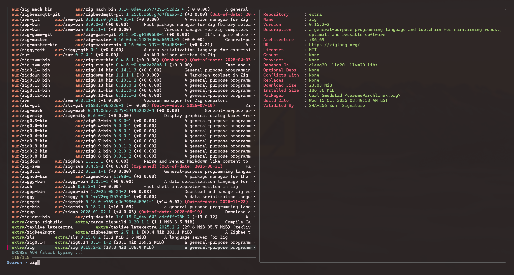

# Arch Browse

Simple bash script using `fzf` and `yay` to browse available packages from all sources (with `bat` for syntax highlighting).

Packages are presented in priority order of `official` before `AUR`.



## Requirements

### `fzf` and `bat`

```bash
sudo pacman -Syu --needed git base-devel fzf bat
```

### `yay`

```bash
git clone https://aur.archlinux.org/yay.git
cd yay
makepkg -si
cd .. && rm -rf yay
```